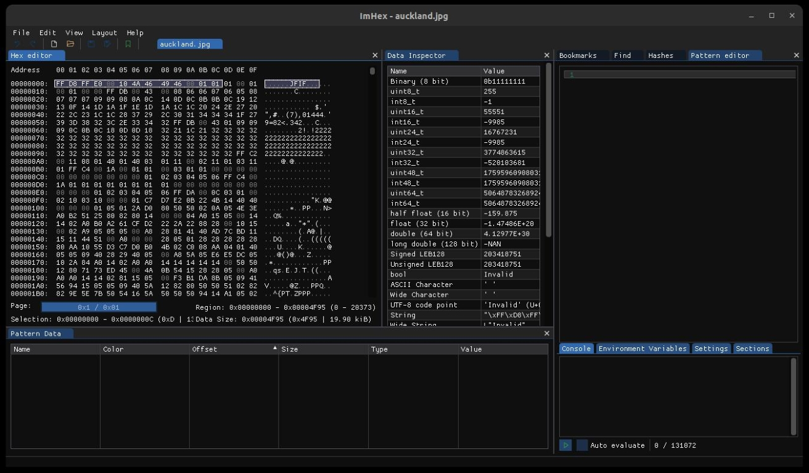
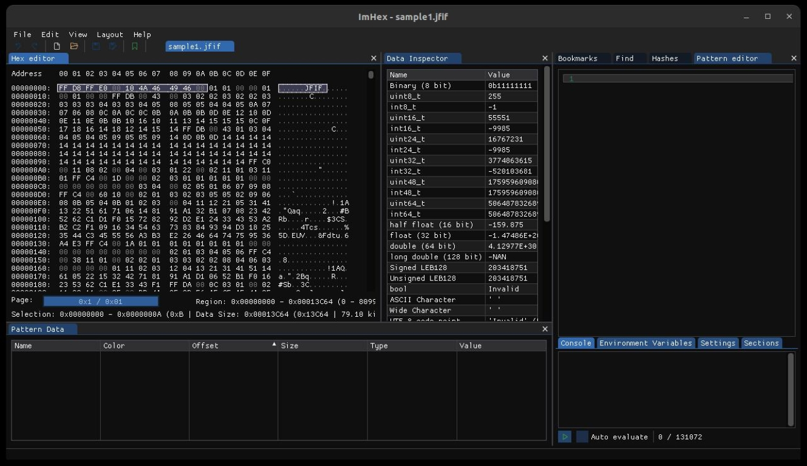
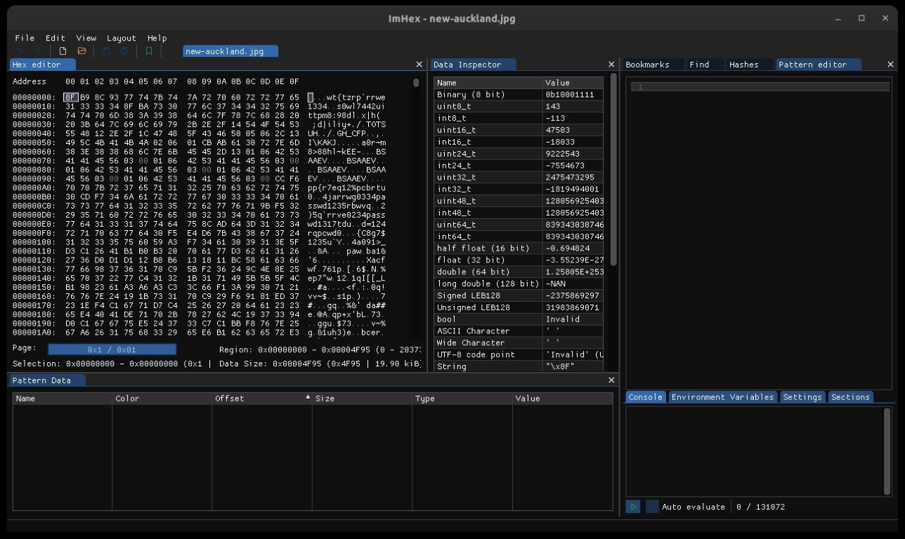
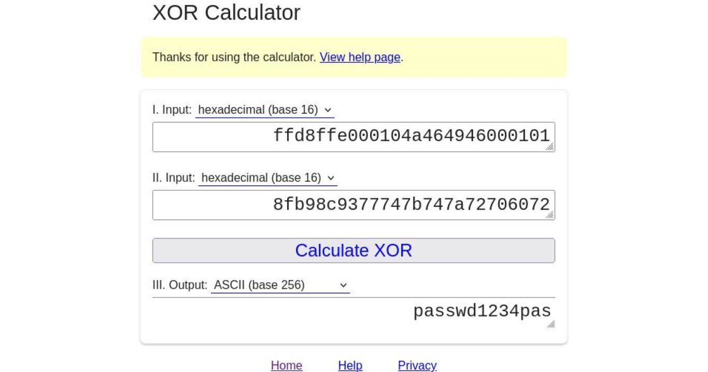
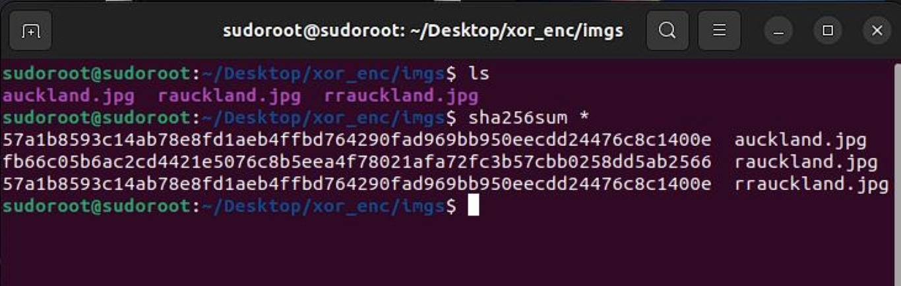

# XOR File Encryption #


## What is the point of this?
I used to gather a lot of malware and their sources for educational purpous and RE so storing them without accidently opening or preventing my antivirus from deleting it all the time is hard. Using this the binary is encrypted into a blob of hex string which makes no sense to any program.

> JCtine

This work is a built up on the [project done by simon](https://github.com/mightbesimon/XOR-file-encryption)

Encrypts files with a password byte-by-byte using a XOR cipher.

## New!
* Added Flipping the File as a block: File is broken into blocks of size given by the user and the block is reversed and replaced.
* This Prevents decryption by bruteforcing the Password using File matadata

Decryption is the same process,  
only the password *used to encrypt* will decrypt the file.


## So why the Extra thing ?
The Concept of XOR is simple 
<pre>      [File XOR Passwd = Enc_File]........(1)
</pre>

And XOR is a Symmetric encryption ie Extracting Passwd is Very simple in plain file XOR Encryption.

<pre>      [File XOR Enc_file = Passwd]........(2)
</pre>

We dont need to bruteforce the key, just filetype is enough to crack the encryption.
All the Files of same type have the exact same matadata ie few bytes at the begining of the file to indicate the system which type is it.


<pre>      File metadata = Sample file Metadata taking 12 Bytes for a start as metadata length and using it in Eqn(2)

      [File XOR Enc_file = Passwd]

      [File metadata XOR First 12 Bytes of(Enc_File) = First 12 Bytes of(Passwd)]

      [Sample_File metadata XOR First 12 Bytes of(Enc_File) = First 12 Bytes of(Passwd)]

      [First 12 Bytes of(Sample_File) XOR First 12 Bytes of(Enc_File) = First 12 Bytes of(Passwd)]
</pre>


### Cracking Password Xor without Flipping Encryption
The [File](without_flipping/XOR-file-encryption/ref_pics/auckland.jpg) 
The [Sample_file](without_flipping/XOR-file-encryption/ref_pics/sample.jpg) 

From these we can see that the first 12 Bytes are same 

This is the hex of Enc_file
The [Enc_file](without_flipping/XOR-file-encryption/ref_pics/new_auckland.jpg) 

To fnd the passwd all we do is 
```
First 12 Bytes of(Sample_File) XOR First 12 Bytes of(Enc_File) = First 12 Bytes of(Passwd)
```


All the files are included in the repo in /without_flipping/XOR-file-encryption.

### compile ###

```bash
$ gcc enc.c -o xore #Just encrypting engine
$ gcc dec.c -o xord #Just decrypting engine
$ gcc both.c -o xorb #This alone is enough
```

### Usage ###

```
$ ./xorb <mode[-e or -d]> <filename> <password> <reversing block size[<16]>
```

### Example ###
```bash
$ ./xorb -e auckland.jpg password1 13 #OR
$ ./xore auckland.jpg passwdd123 13
```
will produce `rauckland.jpg` file, to decrypt:
```bash
$ ./xorb -d rauckland.jpg password1 13 #OR
$ ./xord rauckland.jpg passwdd123 13
```
`rrauckland.jpg` will be identical to the original
## Hashes
The Hash of auckland.jpg and rrauckland.jpg is same



## Authors ##
- **JCtine** - [ZeroX29a](https://github.com/ZeroX29a)
- **simon** - [mightbesimon](https://github.com/mightbesimon)

## License ##

MIT

## Acknowledgments ##

- **these are just my sample codes, if you misuse them its not my problem**
